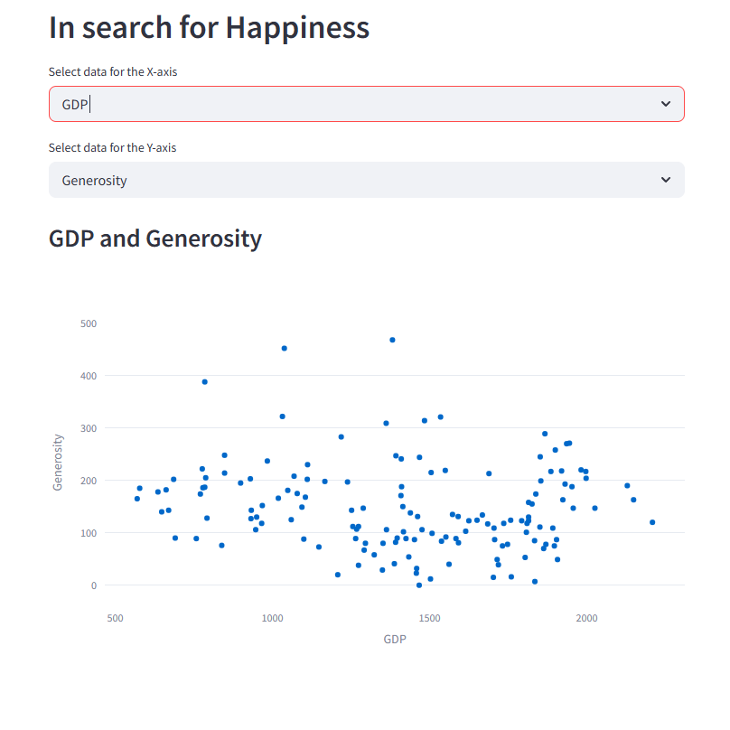

# In Search for Happiness

A Streamlit-based web application that visualizes the relationship between GDP, Happiness Score, and Generosity across various countries.

## 🌍 Overview

This project presents an interactive dashboard allowing users to explore how economic and social factors correlate with happiness indicators. Users can dynamically select variables to analyze and gain insights through visualizations.

## 🚀 Features

- Interactive selection of X and Y axes for plotting
- Dynamic scatter plots with hover tooltips
- Clean and responsive UI using Streamlit
- Data sourced from a CSV file containing global happiness metrics

## 🛠️ Technologies Used

- Python
- Streamlit
- Plotly
- Pandas

## 📦 Installation

1. Clone the repository:
   git clone https://github.com/DziwiszBB/Data-Visualization-App.git
   cd in-search-for-happiness

2. Install the required packages:
   pip install -r requirements.txt

3. Run the application:
   streamlit run main.py

## 📁 Dataset
The dataset 004 happy.csv includes metrics such as GDP per capita, Happiness Score, and Generosity for various countries.

File `004 happy.csv` contains the following columns:

- `Country`: Name of the country.
- `GDP per capita`: Gross Domestic Product per capita, reflecting the economic output per person.
- `Happiness Score`: A measure of the average happiness level of the country's population, typically on a scale from 0 to 10.
- `Generosity`: A metric indicating the generosity of the population, often based on charitable donations and helping behavior.

Sample data row:​

| Country | GDP per capita | Happiness Score | Generosity |
|---------|----------------|-----------------|------------|
| Norway  | 1.616          | 7.537           | 0.362      |

## 📸 Screenshots

## 📄 License
his project is licensed under the MIT License. See the [LICENSE](LICENSE) file for details.

## 🙋‍♂️ Author

**Piotr Dziwisz**

- [LinkedIn](https://www.linkedin.com/in/piotr-dziwisz-8a20b7362/)
- [GitHub](https://github.com/DziwiszBB)
- 📧 dziwiszbusybusiness@gmail.com
